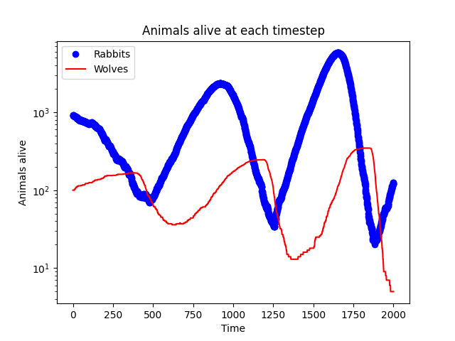
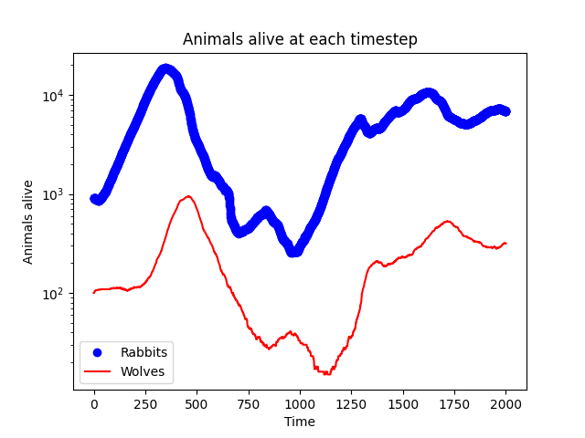
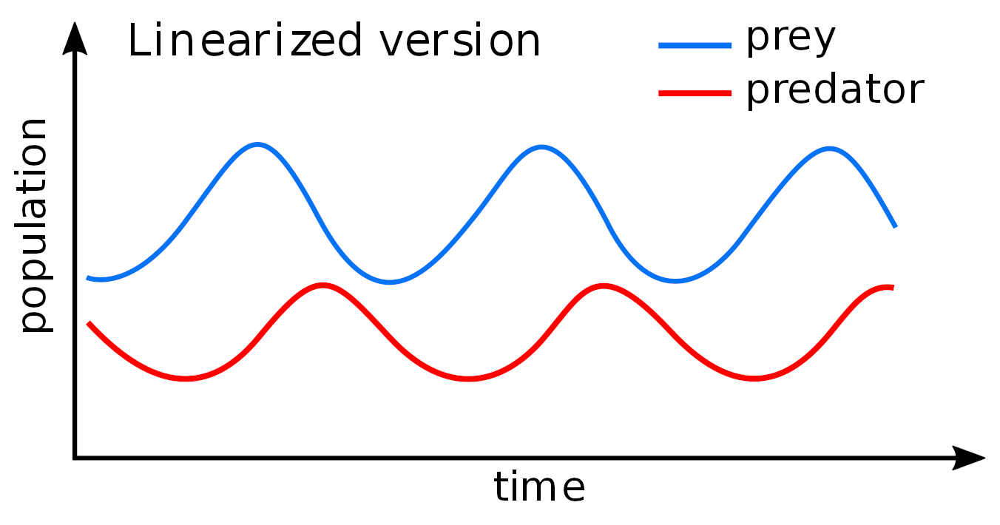

# Prey Preadator

Agent model simulation of a prey predatol system.

# How to run
Run the code by ```python3 main.py```
The settings can be changed in ```settings.py```

# Result
The figures show the evolution in time of the system for 2000 timesteps for different configurations.


<p float="middle">
  
  

</p>

The evolution in time resembles Lotka–Volterra equation in the figure below.

<p float="middle">
   
</p>

